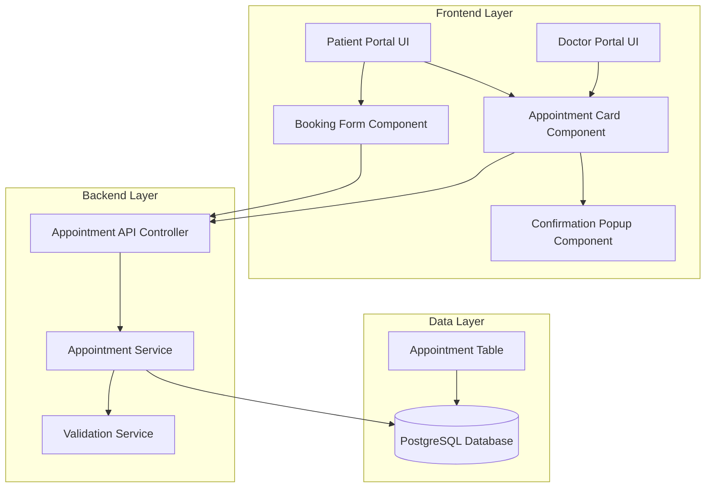
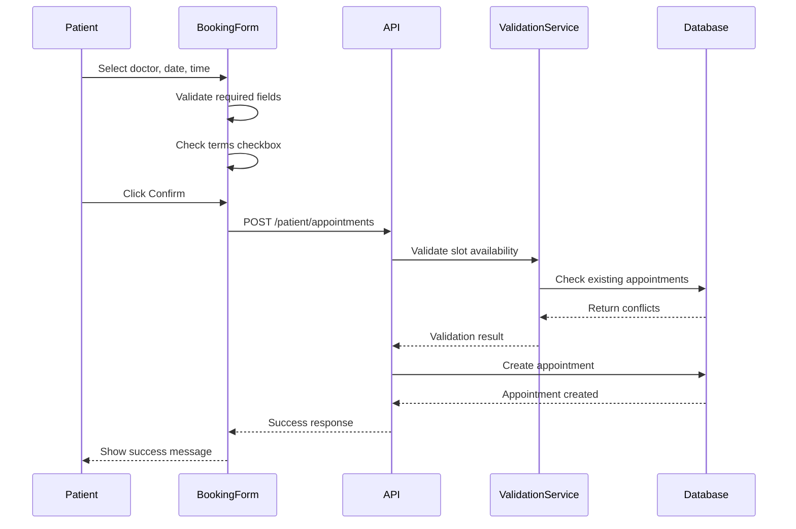
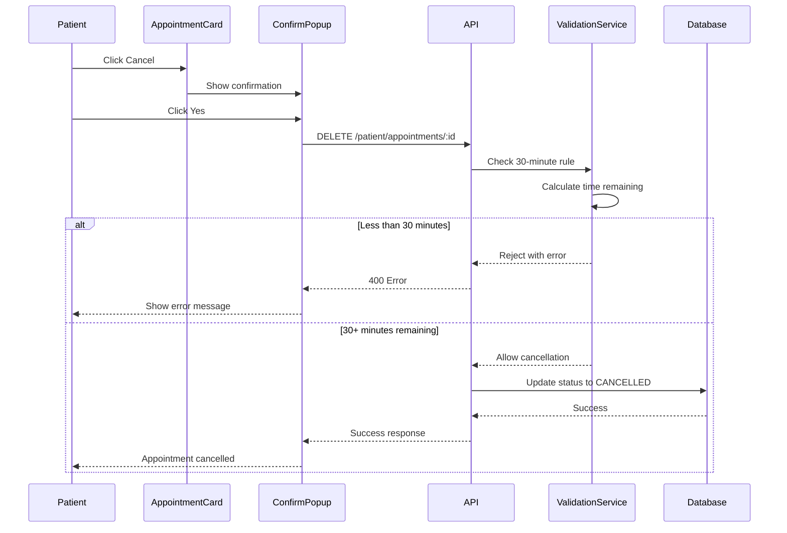
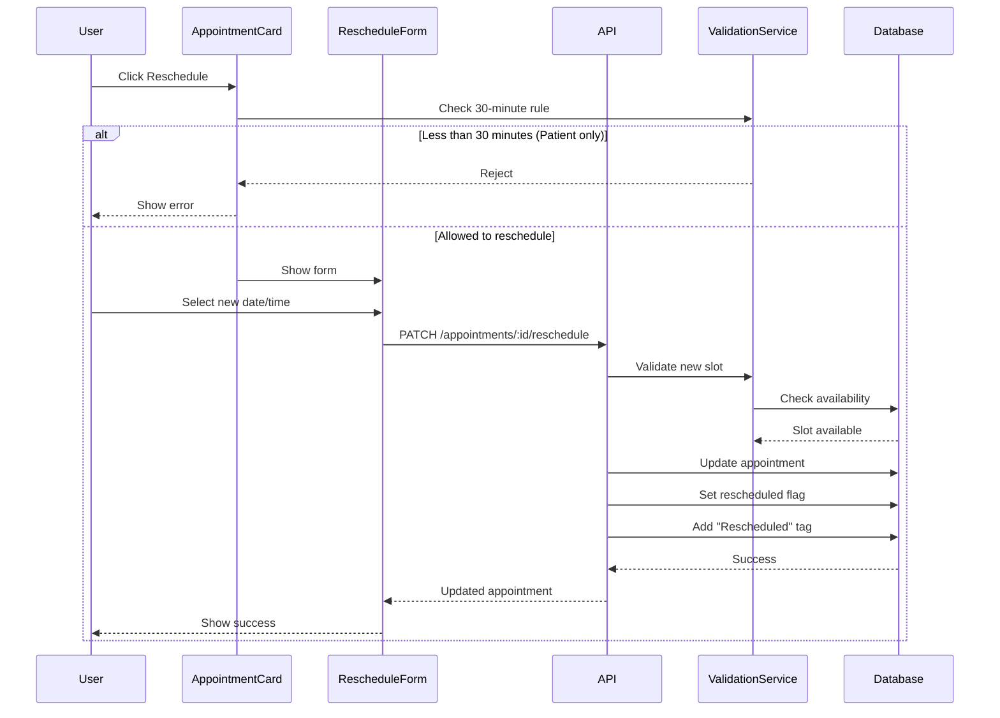

# Design Document: Enhanced Appointment Flow

## Overview

This design document specifies the technical implementation for enhancing the existing appointment booking and management system. The enhancements focus on improving user experience through better UI controls, implementing business rules (30-minute cancellation window), adding rescheduling functionality, and providing clear visual feedback for appointment states.

### Scope

This design covers:
- **Frontend UI Enhancements**: Updates to existing booking forms, appointment cards, and doctor schedule displays
- **Backend API Updates**: Modifications to existing appointment endpoints to support new validation rules and rescheduling
- **Database Schema Updates**: Addition of fields to track rescheduling and appointment tags
- **Business Logic**: Implementation of 30-minute cancellation rule and overdue appointment detection

### Key Design Principles

1. **Enhance, Don't Replace**: Update existing components and APIs rather than creating new ones
2. **Consistent UX**: Maintain application theme and design patterns across all changes
3. **Clear Feedback**: Provide explicit error messages and confirmation dialogs for all critical actions
4. **Role-Based Permissions**: Enforce different rules for patients vs. doctors
5. **Data Integrity**: Preserve original appointment data even when rescheduled

## Architecture

### System Components



### Data Flow

#### Appointment Booking Flow


#### Appointment Cancellation Flow (Patient)


#### Appointment Rescheduling Flow


## Components and Interfaces

### Frontend Components

#### 1. Enhanced Booking Form Component

**Location**: `frontend/src/app/dashboard/patient/appointments/page.tsx`

**Updates Required**:
- Add terms and conditions checkbox
- Implement AM/PM time format conversion
- Add comprehensive field validation
- Disable past dates in date picker
- Improve dropdown styling for doctor selection

**Component Structure**:
```typescript
interface BookingFormProps {
  onSuccess: () => void;
  onCancel: () => void;
}

interface BookingFormState {
  selectedDoctorId: string;
  selectedDate: string;
  selectedSlot: string;
  termsAccepted: boolean;
  errors: Record<string, string>;
}
```

**Key Methods**:
- `validateForm()`: Check all required fields and terms acceptance
- `formatTimeToAMPM(time: string)`: Convert 24-hour to AM/PM format
- `handleSubmit()`: Submit booking with validation

#### 2. Appointment Card Component

**Location**: `frontend/src/app/dashboard/patient/appointments/page.tsx` and `frontend/src/app/dashboard/doctor/appointments/page.tsx`

**Updates Required**:
- Add "Reschedule" button for SCHEDULED appointments
- Display "Rescheduled" tag when applicable
- Show "Overdue" label for past scheduled appointments (doctor view)
- Implement confirmation popup for cancellation
- Format time slots in AM/PM

**Component Structure**:
```typescript
interface AppointmentCardProps {
  appointment: Appointment;
  userRole: 'PATIENT' | 'DOCTOR';
  onCancel: (id: string) => void;
  onReschedule: (id: string) => void;
}

interface Appointment {
  id: string;
  date: Date;
  timeSlot: string;
  status: 'SCHEDULED' | 'COMPLETED' | 'CANCELLED';
  isRescheduled: boolean;
  tags: string[];
  patient?: { id: string; name: string };
  doctor?: { id: string; name: string };
}
```

**Key Methods**:
- `isOverdue()`: Check if appointment time has passed
- `canCancel()`: Determine if cancellation is allowed based on role and time
- `canReschedule()`: Determine if rescheduling is allowed
- `formatTimeAMPM(slot: string)`: Display time in AM/PM format

#### 3. Confirmation Popup Component

**Location**: `frontend/src/components/ConfirmationPopup.tsx` (new component)

**Purpose**: Reusable confirmation dialog for critical actions

**Component Structure**:
```typescript
interface ConfirmationPopupProps {
  isOpen: boolean;
  title: string;
  message: string;
  confirmText?: string;
  cancelText?: string;
  onConfirm: () => void;
  onCancel: () => void;
  variant?: 'danger' | 'warning' | 'info';
}
```

**Styling**: Use application theme colors (teal primary, red for danger)

#### 4. Reschedule Form Component

**Location**: `frontend/src/components/RescheduleForm.tsx` (new component)

**Purpose**: Modal form for selecting new appointment date and time

**Component Structure**:
```typescript
interface RescheduleFormProps {
  appointmentId: string;
  doctorId: string;
  currentDate: Date;
  currentSlot: string;
  onSuccess: () => void;
  onCancel: () => void;
}
```

**Key Features**:
- Fetch available slots for selected date
- Disable past dates
- Show current appointment details
- Display AM/PM formatted times

### Backend Components

#### 1. Appointment Controller Updates

**Location**: `backend/src/patient/patient.controller.ts` (new controller) and `backend/src/doctor/doctor.controller.ts`

**New/Updated Endpoints**:

```typescript
// Patient endpoints (new controller needed)
POST   /patient/appointments              // Book appointment
GET    /patient/appointments              // List patient's appointments
DELETE /patient/appointments/:id          // Cancel appointment (with 30-min rule)
PATCH  /patient/appointments/:id/reschedule // Reschedule appointment

// Doctor endpoints (update existing controller)
GET    /doctor/appointments               // List doctor's appointments (existing)
DELETE /doctor/appointments/:id           // Cancel any appointment (no time restriction)
PATCH  /doctor/appointments/:id/reschedule // Reschedule any appointment
PATCH  /doctor/appointments/:id/complete  // Mark appointment as completed
```

**Controller Methods**:
```typescript
@Controller('patient')
export class PatientController {
  @Post('appointments')
  async bookAppointment(@Body() dto: BookAppointmentDto, @Request() req): Promise<Appointment>
  
  @Get('appointments')
  async listAppointments(@Query() query: AppointmentQueryDto, @Request() req): Promise<PaginatedResponse<Appointment>>
  
  @Delete('appointments/:id')
  async cancelAppointment(@Param('id') id: string, @Request() req): Promise<void>
  
  @Patch('appointments/:id/reschedule')
  async rescheduleAppointment(@Param('id') id: string, @Body() dto: RescheduleDto, @Request() req): Promise<Appointment>
}

@Controller('doctor')
export class DoctorController {
  // Existing methods...
  
  @Delete('appointments/:id')
  async cancelAppointment(@Param('id') id: string, @Request() req): Promise<void>
  
  @Patch('appointments/:id/reschedule')
  async rescheduleAppointment(@Param('id') id: string, @Body() dto: RescheduleDto, @Request() req): Promise<Appointment>
  
  @Patch('appointments/:id/complete')
  async completeAppointment(@Param('id') id: string, @Request() req): Promise<Appointment>
}
```

#### 2. Appointment Service Updates

**Location**: `backend/src/patient/patient.service.ts` (new service) and updates to `backend/src/doctor/doctor.service.ts`

**Key Methods**:

```typescript
export class AppointmentService {
  // Validation methods
  async validateCancellationWindow(appointmentId: string, userRole: Role): Promise<boolean>
  async calculateTimeUntilAppointment(appointment: Appointment): Promise<number>
  async isAppointmentOverdue(appointment: Appointment): Promise<boolean>
  
  // Business logic methods
  async bookAppointment(dto: BookAppointmentDto, patientId: string, tenantId: string): Promise<Appointment>
  async cancelAppointment(appointmentId: string, userId: string, userRole: Role, tenantId: string): Promise<void>
  async rescheduleAppointment(appointmentId: string, dto: RescheduleDto, userId: string, userRole: Role, tenantId: string): Promise<Appointment>
  async completeAppointment(appointmentId: string, doctorId: string, tenantId: string): Promise<Appointment>
  
  // Query methods
  async listAppointments(filters: AppointmentFilters, userId: string, userRole: Role, tenantId: string): Promise<PaginatedResponse<Appointment>>
  async getAppointmentById(id: string, tenantId: string): Promise<Appointment>
  
  // Helper methods
  async checkSlotAvailability(doctorId: string, date: Date, timeSlot: string, tenantId: string): Promise<boolean>
  async addRescheduledTag(appointmentId: string): Promise<void>
  async enrichAppointmentWithTags(appointment: Appointment): Promise<Appointment>
}
```

**Validation Logic**:
```typescript
async validateCancellationWindow(appointmentId: string, userRole: Role): Promise<boolean> {
  const appointment = await this.prisma.appointment.findUnique({ where: { id: appointmentId } });
  
  // Doctors can cancel anytime
  if (userRole === Role.DOCTOR) {
    return true;
  }
  
  // Patients must respect 30-minute window
  const appointmentDateTime = this.combineDateTime(appointment.date, appointment.timeSlot);
  const now = new Date();
  const minutesUntil = (appointmentDateTime.getTime() - now.getTime()) / (1000 * 60);
  
  if (minutesUntil < 30) {
    throw new BadRequestException('Cannot cancel appointment within 30 minutes of scheduled time');
  }
  
  return true;
}
```

#### 3. DTOs (Data Transfer Objects)

**Location**: `backend/src/patient/dto/` and `backend/src/doctor/dto/`

```typescript
// Book Appointment DTO
export class BookAppointmentDto {
  @IsString()
  @IsNotEmpty()
  doctorId: string;

  @IsDateString()
  @IsNotEmpty()
  date: string;

  @IsString()
  @IsNotEmpty()
  timeSlot: string;
}

// Reschedule Appointment DTO
export class RescheduleDto {
  @IsDateString()
  @IsNotEmpty()
  newDate: string;

  @IsString()
  @IsNotEmpty()
  newTimeSlot: string;
}

// Appointment Query DTO (update existing)
export class AppointmentQueryDto {
  @IsOptional()
  @IsEnum(['SCHEDULED', 'COMPLETED', 'CANCELLED'])
  status?: string;

  @IsOptional()
  @IsDateString()
  startDate?: string;

  @IsOptional()
  @IsDateString()
  endDate?: string;

  @IsOptional()
  @IsInt()
  @Min(1)
  @Type(() => Number)
  page?: number = 1;

  @IsOptional()
  @IsInt()
  @Min(1)
  @Max(100)
  @Type(() => Number)
  limit?: number = 10;
}
```

### API Response Formats

#### Success Response
```json
{
  "id": "uuid",
  "patientId": "uuid",
  "doctorId": "uuid",
  "date": "2025-05-15T00:00:00.000Z",
  "timeSlot": "2:00 PM",
  "status": "SCHEDULED",
  "isRescheduled": false,
  "tags": [],
  "createdAt": "2025-04-25T10:00:00.000Z",
  "updatedAt": "2025-04-25T10:00:00.000Z",
  "patient": {
    "id": "uuid",
    "name": "John Doe"
  },
  "doctor": {
    "id": "uuid",
    "name": "Dr. Smith"
  }
}
```

#### Error Response
```json
{
  "statusCode": 400,
  "message": "Cannot cancel appointment within 30 minutes of scheduled time",
  "error": "Bad Request"
}
```

## Data Models

### Database Schema Updates

#### Appointment Table Updates

**Location**: `backend/prisma/schema.prisma`

**Required Changes**:
```prisma
model Appointment {
  id            String            @id @default(uuid())
  patientId     String
  doctorId      String
  date          DateTime
  timeSlot      String
  status        AppointmentStatus @default(SCHEDULED)
  isRescheduled Boolean           @default(false)  // NEW FIELD
  tags          String[]          @default([])     // NEW FIELD
  tenantId      String
  createdAt     DateTime          @default(now())
  updatedAt     DateTime          @updatedAt

  patient Patient @relation(fields: [patientId], references: [id])
  doctor  User    @relation("DoctorAppointments", fields: [doctorId], references: [id])

  @@unique([doctorId, date, timeSlot])
  @@index([patientId])
  @@index([doctorId, date])
  @@index([tenantId])
  @@index([status])
  @@index([isRescheduled])  // NEW INDEX
}
```

**Migration Strategy**:
1. Add `isRescheduled` field as nullable boolean
2. Add `tags` field as empty array default
3. Backfill existing appointments with `isRescheduled = false` and `tags = []`
4. Make fields non-nullable after backfill

**Migration File**:
```sql
-- Add new fields
ALTER TABLE "Appointment" ADD COLUMN "isRescheduled" BOOLEAN DEFAULT false;
ALTER TABLE "Appointment" ADD COLUMN "tags" TEXT[] DEFAULT ARRAY[]::TEXT[];

-- Create index for performance
CREATE INDEX "Appointment_isRescheduled_idx" ON "Appointment"("isRescheduled");

-- Backfill existing data (already done by defaults)
UPDATE "Appointment" SET "isRescheduled" = false WHERE "isRescheduled" IS NULL;
UPDATE "Appointment" SET "tags" = ARRAY[]::TEXT[] WHERE "tags" IS NULL;
```

### Data Validation Rules

1. **Appointment Date**: Must be in the future (for new bookings)
2. **Time Slot**: Must match doctor's available slots
3. **Doctor Availability**: Check against `DoctorSchedule` and `BlockedDate`
4. **Unique Constraint**: One appointment per doctor per time slot
5. **Status Transitions**: 
   - SCHEDULED → COMPLETED (doctor only)
   - SCHEDULED → CANCELLED (patient with 30-min rule, doctor anytime)
   - Cannot transition from COMPLETED or CANCELLED

## Error Handling

### Error Categories and Messages

#### Validation Errors (HTTP 400)
```typescript
const ERROR_MESSAGES = {
  REQUIRED_FIELD: 'This field is required',
  PAST_DATE: 'Please select a future date',
  NO_TIME_SLOT: 'Please select a time slot',
  TERMS_NOT_ACCEPTED: 'You must accept the terms and conditions',
  CANCELLATION_WINDOW: 'Cannot cancel appointment within 30 minutes of scheduled time',
  RESCHEDULE_WINDOW: 'Cannot reschedule appointment within 30 minutes of scheduled time',
  SLOT_UNAVAILABLE: 'The selected time slot is no longer available',
  INVALID_DATE_FORMAT: 'Invalid date format',
  INVALID_TIME_FORMAT: 'Invalid time format',
};
```

#### Authorization Errors (HTTP 403)
```typescript
const AUTH_ERRORS = {
  NOT_YOUR_APPOINTMENT: 'You do not have permission to modify this appointment',
  ROLE_REQUIRED: 'You do not have permission to perform this action',
};
```

#### Not Found Errors (HTTP 404)
```typescript
const NOT_FOUND_ERRORS = {
  APPOINTMENT_NOT_FOUND: 'Appointment not found',
  DOCTOR_NOT_FOUND: 'Doctor not found',
  PATIENT_NOT_FOUND: 'Patient not found',
};
```

#### Network Errors
```typescript
const NETWORK_ERRORS = {
  CONNECTION_ERROR: 'Unable to connect. Please check your connection and try again',
  TIMEOUT: 'Request timed out. Please try again',
  SERVER_ERROR: 'An unexpected error occurred. Please try again later',
};
```

### Frontend Error Handling

**Error Display Component**:
```typescript
interface ErrorMessageProps {
  message: string;
  type: 'error' | 'warning' | 'info';
}

const ErrorMessage: React.FC<ErrorMessageProps> = ({ message, type }) => {
  const styles = {
    error: 'bg-red-50 border-red-200 text-red-700',
    warning: 'bg-yellow-50 border-yellow-200 text-yellow-700',
    info: 'bg-blue-50 border-blue-200 text-blue-700',
  };
  
  return (
    <div className={`flex gap-2 p-3 border rounded-lg ${styles[type]}`}>
      <AlertCircle size={18} className="flex-shrink-0" />
      <p className="text-sm">{message}</p>
    </div>
  );
};
```

### Backend Error Handling

**Custom Exception Filters**:
```typescript
@Catch()
export class AppointmentExceptionFilter implements ExceptionFilter {
  catch(exception: any, host: ArgumentsHost) {
    const ctx = host.switchToHttp();
    const response = ctx.getResponse();
    
    let status = HttpStatus.INTERNAL_SERVER_ERROR;
    let message = 'An unexpected error occurred';
    
    if (exception instanceof BadRequestException) {
      status = HttpStatus.BAD_REQUEST;
      message = exception.message;
    } else if (exception instanceof ForbiddenException) {
      status = HttpStatus.FORBIDDEN;
      message = exception.message;
    } else if (exception instanceof NotFoundException) {
      status = HttpStatus.NOT_FOUND;
      message = exception.message;
    }
    
    response.status(status).json({
      statusCode: status,
      message,
      error: exception.name,
      timestamp: new Date().toISOString(),
    });
  }
}
```

## Testing Strategy

### Unit Tests

#### Frontend Unit Tests
**Location**: `frontend/src/__tests__/`

**Test Cases**:
1. **Booking Form Validation**
   - Required field validation
   - Terms checkbox validation
   - Date validation (no past dates)
   - Time slot selection validation

2. **Time Format Conversion**
   - Convert 24-hour to AM/PM format
   - Handle edge cases (midnight, noon)

3. **Appointment Card Logic**
   - Overdue detection
   - Cancellation eligibility
   - Reschedule eligibility
   - Tag display logic

4. **Confirmation Popup**
   - Render with correct message
   - Handle confirm/cancel actions
   - Apply correct theme styling

#### Backend Unit Tests
**Location**: `backend/src/patient/__tests__/` and `backend/src/doctor/__tests__/`

**Test Cases**:
1. **Cancellation Window Validation**
   - Allow cancellation with 30+ minutes remaining
   - Reject cancellation with <30 minutes remaining
   - Allow doctor cancellation anytime
   - Calculate time correctly across timezones

2. **Appointment Booking**
   - Create appointment with valid data
   - Reject duplicate bookings
   - Validate slot availability
   - Check doctor schedule constraints

3. **Rescheduling Logic**
   - Update appointment date and time
   - Set rescheduled flag
   - Add "Rescheduled" tag
   - Validate new slot availability
   - Apply 30-minute rule for patients

4. **Overdue Detection**
   - Identify appointments past scheduled time
   - Only flag SCHEDULED status appointments

### Integration Tests

**Test Scenarios**:
1. **End-to-End Booking Flow**
   - Patient selects doctor, date, time
   - System validates availability
   - Appointment created in database
   - Confirmation displayed to user

2. **Cancellation Flow with Time Validation**
   - Patient attempts cancellation
   - System checks time remaining
   - Appropriate response based on time
   - Database updated correctly

3. **Rescheduling Flow**
   - User initiates reschedule
   - System validates new slot
   - Appointment updated with new time
   - Rescheduled flag and tag added

4. **Doctor vs Patient Permissions**
   - Doctor can cancel anytime
   - Patient restricted by 30-minute rule
   - Both can reschedule (with patient restrictions)

### Manual Testing Checklist

- [ ] Booking form displays correctly with all fields
- [ ] Past dates are disabled in date picker
- [ ] Time slots display in AM/PM format
- [ ] Terms checkbox is required
- [ ] Error messages display for invalid inputs
- [ ] Confirmation popup appears for cancellation
- [ ] Cancellation blocked within 30 minutes (patient)
- [ ] Doctor can cancel anytime
- [ ] Reschedule form displays available slots
- [ ] Rescheduled tag appears after rescheduling
- [ ] Overdue label shows for past appointments (doctor view)
- [ ] All buttons use consistent theme colors
- [ ] Loading states display correctly
- [ ] Network errors handled gracefully

## Implementation Plan

### Phase 1: Database and Backend Foundation
1. Create database migration for new fields
2. Update Prisma schema
3. Run migration on development database
4. Create PatientController and PatientService
5. Implement appointment booking endpoint
6. Implement cancellation validation logic
7. Implement rescheduling logic
8. Add unit tests for service methods

### Phase 2: Backend API Completion
1. Update DoctorController with new endpoints
2. Implement overdue detection logic
3. Create DTOs for all endpoints
4. Add validation pipes
5. Implement error handling
6. Add integration tests
7. Update API documentation

### Phase 3: Frontend Components
1. Create ConfirmationPopup component
2. Create RescheduleForm component
3. Update BookingForm with new validations
4. Add terms checkbox to BookingForm
5. Implement AM/PM time formatting
6. Update AppointmentCard component
7. Add Reschedule button logic
8. Add Rescheduled tag display
9. Add Overdue label (doctor view)

### Phase 4: Frontend Integration
1. Create React Query hooks for new endpoints
2. Update patient appointments page
3. Update doctor appointments page
4. Implement confirmation dialogs
5. Add error handling and display
6. Add loading states
7. Test all user flows

### Phase 5: Testing and Polish
1. Run all unit tests
2. Run integration tests
3. Perform manual testing
4. Fix bugs and edge cases
5. Update documentation
6. Code review
7. Deploy to staging
8. User acceptance testing

## Security Considerations

### Authentication and Authorization
- All endpoints require JWT authentication
- Role-based access control (RBAC) enforced
- Patients can only access their own appointments
- Doctors can only access appointments in their tenant
- Validate user ownership before any modification

### Data Validation
- Sanitize all user inputs
- Validate date formats server-side
- Prevent SQL injection through Prisma ORM
- Validate time slot formats
- Check appointment ownership before updates

### Rate Limiting
- Implement rate limiting on booking endpoints
- Prevent spam bookings
- Limit cancellation attempts

### Audit Trail
- Log all appointment modifications
- Track who made changes and when
- Store original appointment data before rescheduling

## Performance Considerations

### Database Optimization
- Indexes on frequently queried fields (doctorId, date, status, isRescheduled)
- Composite index on (doctorId, date, timeSlot) for uniqueness
- Pagination for appointment lists
- Efficient queries using Prisma select

### Frontend Optimization
- Lazy load appointment lists
- Debounce search inputs
- Cache doctor list
- Optimize re-renders with React.memo
- Use React Query for caching

### API Optimization
- Return only necessary fields
- Implement pagination
- Use database indexes effectively
- Cache frequently accessed data (doctor schedules)

## Deployment Strategy

### Database Migration
```bash
# Generate migration
npx prisma migrate dev --name add_appointment_rescheduling_fields

# Apply to production
npx prisma migrate deploy
```

### Backend Deployment
1. Deploy backend changes
2. Run database migrations
3. Verify API endpoints
4. Monitor error logs

### Frontend Deployment
1. Build frontend with new changes
2. Deploy to CDN/hosting
3. Verify UI functionality
4. Monitor client-side errors

### Rollback Plan
- Keep previous database schema version
- Maintain backward compatibility during transition
- Feature flags for gradual rollout
- Quick rollback procedure documented

## Monitoring and Observability

### Metrics to Track
- Appointment booking success rate
- Cancellation rate (within/outside 30-minute window)
- Reschedule frequency
- API response times
- Error rates by endpoint
- User engagement with new features

### Logging
- Log all appointment state changes
- Log validation failures
- Log cancellation attempts (allowed/rejected)
- Log rescheduling operations
- Include user ID, appointment ID, timestamp

### Alerts
- High error rate on booking endpoint
- Unusual cancellation patterns
- Database connection issues
- API response time degradation

## Documentation

### User Documentation
**Location**: `docs/APPOINTMENT_FEATURES.md`

**Contents**:
- How to book an appointment
- Understanding the 30-minute cancellation rule
- How to reschedule an appointment
- Difference between patient and doctor permissions
- What "Overdue" means
- What "Rescheduled" tag indicates
- Troubleshooting common errors

### Developer Documentation
**Location**: `docs/APPOINTMENT_API.md`

**Contents**:
- API endpoint specifications
- Request/response formats
- Error codes and messages
- Authentication requirements
- Rate limiting details
- Database schema
- Business logic rules

### API Documentation (Swagger/OpenAPI)
- Auto-generated from NestJS decorators
- Include all endpoints
- Document request/response schemas
- Include example requests
- Document error responses

## Future Enhancements

### Potential Improvements
1. **Email/SMS Notifications**: Send reminders before appointments
2. **Recurring Appointments**: Support for regular check-ups
3. **Appointment Notes**: Allow doctors to add notes
4. **Video Consultation Integration**: Link to video call platform
5. **Appointment History**: Detailed history with all changes
6. **Bulk Operations**: Cancel/reschedule multiple appointments
7. **Waitlist**: Allow patients to join waitlist for full slots
8. **Appointment Reminders**: Automated reminders 24 hours before
9. **Cancellation Reasons**: Track why appointments are cancelled
10. **Analytics Dashboard**: Appointment trends and insights

### Technical Debt to Address
- Refactor time handling to use proper timezone library
- Centralize date/time formatting utilities
- Create shared validation library
- Improve error message consistency
- Add comprehensive logging framework
- Implement proper caching strategy

## Conclusion

This design provides a comprehensive plan for enhancing the appointment booking and management system. The implementation focuses on improving user experience through better UI controls, enforcing business rules, and providing clear feedback. The design maintains consistency with existing architecture while adding necessary new functionality.

Key success factors:
- Clear separation of patient and doctor permissions
- Robust validation of the 30-minute cancellation rule
- Intuitive UI with confirmation dialogs
- Comprehensive error handling
- Maintainable and testable code structure
- Proper database schema updates with migration strategy

The phased implementation approach ensures systematic development and testing, minimizing risk and allowing for iterative improvements based on feedback.
