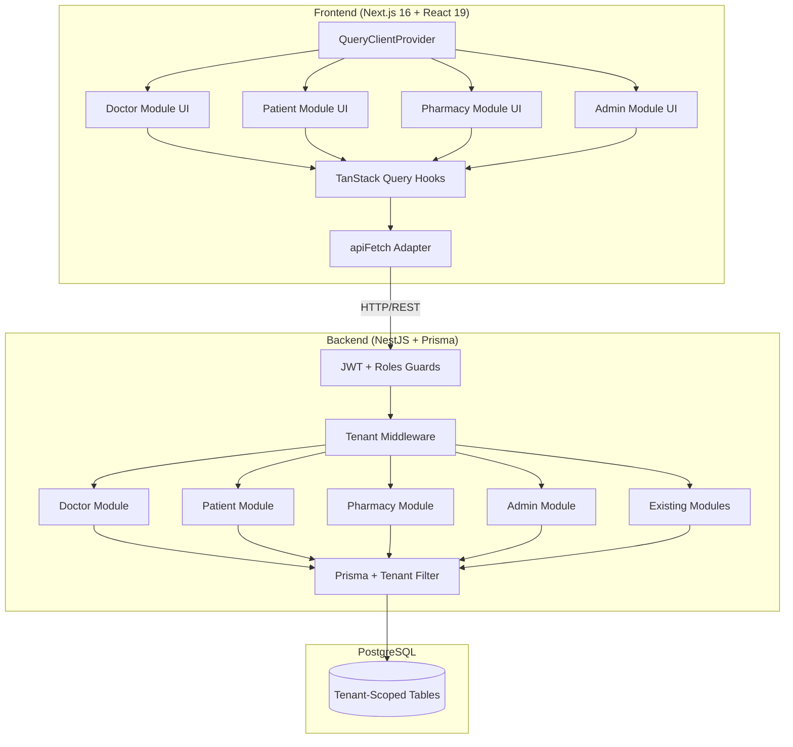
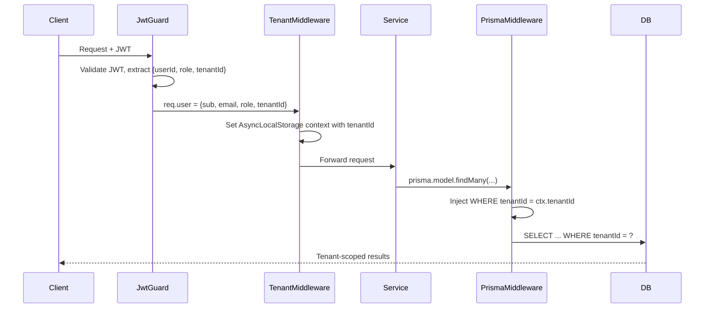

# Design Document: Healthcare Multi-Tenant Platform

## Overview

This design transforms the existing single-tenant healthcare application into a multi-tenant platform. The current system runs NestJS + Prisma + PostgreSQL on the backend and Next.js 16 + React 19 + Tailwind CSS 4 on the frontend. It already has working modules for Auth, Patients, Inventory, Prescriptions, Orders, Payments, Notifications, and Sales.

The transformation involves:

1. **Multi-tenancy via row-level isolation** — adding a `tenantId` column to all tenant-scoped tables and enforcing it through a Prisma middleware that automatically injects tenant filters on every query.
2. **New domain models** — Appointments, AllergyReports, DoctorPharmacyConnections, PurchaseRecords, DoctorSchedules, and a Tenant model.
3. **Role-specific modules** — Doctor, Patient, Pharmacy, and Admin modules with dedicated controllers, services, and frontend routes.
4. **TanStack Query migration** — replacing the custom `apiFetch` cache layer with `@tanstack/react-query` for server-state management while keeping `apiFetch` as the underlying fetch adapter.
5. **Enhanced Sales workflow** — prescription checkout auto-population, PDF invoice generation (via `@react-pdf/renderer` or `pdfmake`), and mobile bill delivery.
6. **Pharmacy sub-module documentation** — six standalone `.md` files covering Prescription, Medicines, Inventory, Purchase, Sales, and Reports tabs.

### Key Design Decisions

| Decision | Rationale |
|---|---|
| Row-level tenancy (shared DB, shared schema) | Simplest migration path for existing data; avoids schema-per-tenant complexity; PostgreSQL handles it well with indexed `tenantId` columns |
| Prisma middleware for tenant scoping | Centralizes enforcement; prevents accidental cross-tenant leaks in any service; transparent to existing service code |
| TanStack Query with `apiFetch` adapter | Preserves existing JWT attachment, retry logic, and error handling; gains caching, background refetch, optimistic updates for free |
| Client-side PDF generation | Avoids server-side headless browser dependency; `@react-pdf/renderer` works in React; keeps backend stateless |
| FIFO batch selection (existing) | Already implemented in `SalesService`; no change needed |

## Architecture

### System Architecture



### Tenant Isolation Flow



### Request Processing Pipeline

Every authenticated request flows through:
1. `JwtAuthGuard` — validates token, attaches `user` to request (extended with `tenantId`)
2. `RolesGuard` — checks role-based access
3. `TenantContextMiddleware` — stores `tenantId` in `AsyncLocalStorage` for the request lifecycle
4. Prisma `$use` middleware — reads `tenantId` from `AsyncLocalStorage` and injects it into all `findMany`, `findFirst`, `findUnique`, `create`, `update`, `delete` operations on tenant-scoped models

Admin users bypass tenant filtering for cross-tenant operations.


## Components and Interfaces

### Backend Components

#### 1. Tenant Module (`backend/src/tenant/`)

Manages tenant lifecycle and provides the tenant context infrastructure.

```typescript
// tenant.model — new Prisma model
model Tenant {
  id        String   @id @default(uuid())
  name      String
  type      TenantType // PHARMACY | CLINIC
  isActive  Boolean  @default(true)
  createdAt DateTime @default(now())
  updatedAt DateTime @updatedAt
  users     User[]
}

// tenant.service.ts
class TenantService {
  createTenant(dto: CreateTenantDto): Promise<Tenant>
  findAll(): Promise<Tenant[]>
  findById(id: string): Promise<Tenant>
  activate(id: string): Promise<Tenant>
  deactivate(id: string): Promise<Tenant>  // also invalidates JWTs
  getUserCount(id: string): Promise<number>
}

// tenant-context.middleware.ts
class TenantContextMiddleware implements NestMiddleware {
  use(req, res, next): void
  // Reads tenantId from req.user, stores in AsyncLocalStorage
}

// prisma-tenant.middleware.ts
// Prisma $use middleware that injects tenantId into queries
// Skips injection for Admin role or non-tenant-scoped models
```

#### 2. Doctor Module (`backend/src/doctor/`)

Handles doctor-specific operations: patient management, allergy reports, prescriptions, pharmacy connections, appointments, and scheduling.

```typescript
// doctor.controller.ts — routes prefixed with /doctor
class DoctorController {
  // Patient management
  POST   /doctor/patients          — createPatient(dto)
  GET    /doctor/patients          — listPatients(query)
  
  // Allergy reports
  POST   /doctor/allergy-reports   — createAllergyReport(dto)
  GET    /doctor/allergy-reports/:patientId — getPatientAllergyReports(patientId)
  
  // Prescriptions
  POST   /doctor/prescriptions     — createPrescription(dto)
  POST   /doctor/prescriptions/:id/dispatch — dispatchToPharmacy(id, pharmacyId)
  
  // Pharmacy connections
  POST   /doctor/pharmacy-connections       — requestConnection(pharmacyId)
  GET    /doctor/pharmacy-connections       — listConnections()
  GET    /doctor/pharmacies                 — listAvailablePharmacies()
  DELETE /doctor/pharmacy-connections/:id   — terminateConnection(id)
  
  // Appointments
  GET    /doctor/appointments      — listAppointments(query)
  
  // Scheduling
  PUT    /doctor/schedule          — setAvailability(dto)
  POST   /doctor/schedule/block    — blockDate(dto)
  DELETE /doctor/schedule/block/:date — unblockDate(date)
  PUT    /doctor/schedule/max-appointments — setMaxAppointments(dto)
}
```

#### 3. Patient Module (`backend/src/patient-portal/`)

Handles patient-facing operations: doctor discovery, appointment booking, prescription viewing.

```typescript
// patient-portal.controller.ts — routes prefixed with /patient
class PatientPortalController {
  // Doctor discovery
  GET    /patient/doctors           — listDoctors(query)
  POST   /patient/doctors/:id/connect — connectWithDoctor(doctorId)
  
  // Appointments
  GET    /patient/doctors/:id/slots — getAvailableSlots(doctorId, date)
  POST   /patient/appointments      — bookAppointment(dto)
  PATCH  /patient/appointments/:id/cancel — cancelAppointment(id)
  GET    /patient/appointments      — listAppointments(query)
  
  // Prescriptions
  GET    /patient/prescriptions     — listPrescriptions(query)
  GET    /patient/prescriptions/:id — getPrescriptionDetail(id)
}
```

#### 4. Pharmacy Module (enhanced `backend/src/pharmacy/`)

Extends existing sales/inventory with prescription checkout, purchase tracking, and reporting.

```typescript
// pharmacy.controller.ts — routes prefixed with /pharmacy
class PharmacyController {
  // Prescriptions tab
  GET    /pharmacy/prescriptions           — listReceivedPrescriptions(query)
  PATCH  /pharmacy/prescriptions/:id/dispense — dispensePrescription(id)
  
  // Medicines tab
  GET    /pharmacy/medicines               — listMedicines(query)
  POST   /pharmacy/medicines               — addMedicine(dto)
  PUT    /pharmacy/medicines/:id           — updateMedicine(id, dto)
  
  // Inventory tab
  GET    /pharmacy/inventory               — listInventory(query)
  GET    /pharmacy/inventory/alerts        — getAlerts()
  
  // Purchase tab
  POST   /pharmacy/purchases               — recordPurchase(dto)
  GET    /pharmacy/purchases               — listPurchases(query)
  
  // Sales tab (extends existing)
  POST   /pharmacy/sales                   — createSale(dto)
  POST   /pharmacy/sales/prescription-checkout — checkoutPrescription(prescriptionId)
  GET    /pharmacy/sales                   — listSales(query)
  GET    /pharmacy/sales/:id               — getSaleDetail(id)
  GET    /pharmacy/sales/:id/invoice       — getInvoice(id)
  POST   /pharmacy/sales/:id/send-bill     — sendBillToPatient(id)
  
  // Reports tab
  GET    /pharmacy/reports/daily           — getDailyReport(date)
  GET    /pharmacy/reports/top-medicines   — getTopMedicines(query)
  GET    /pharmacy/reports/weekly-summary  — getWeeklySummary(query)
  GET    /pharmacy/reports/payment-breakdown — getPaymentBreakdown(query)
}
```

#### 5. Admin Module (`backend/src/admin/`)

Platform-wide administration.

```typescript
// admin.controller.ts — routes prefixed with /admin
class AdminController {
  GET    /admin/tenants             — listTenants(query)
  PATCH  /admin/tenants/:id/activate   — activateTenant(id)
  PATCH  /admin/tenants/:id/deactivate — deactivateTenant(id)
  GET    /admin/users               — listUsers(query)
  PATCH  /admin/users/:id/activate     — activateUser(id)
  PATCH  /admin/users/:id/deactivate   — deactivateUser(id)
}
```

### Frontend Components

#### TanStack Query Setup

```typescript
// frontend/src/lib/query-client.ts
const queryClient = new QueryClient({
  defaultOptions: {
    queries: {
      staleTime: 5 * 60 * 1000,    // 5 minutes
      retry: 2,
      refetchOnWindowFocus: false,
    },
    mutations: {
      retry: 0,
    },
  },
});

// frontend/src/providers/QueryProvider.tsx
// Wraps app with QueryClientProvider + ReactQueryDevtools
```

#### Hook Layer (`frontend/src/hooks/`)

Each module gets a dedicated hooks file using TanStack Query:

```typescript
// hooks/useDoctorQueries.ts
usePatients(filters)        → useQuery(['doctor', 'patients', filters], ...)
useCreatePatient()          → useMutation + invalidate(['doctor', 'patients'])
useAllergyReports(patientId)→ useQuery(['doctor', 'allergy-reports', patientId], ...)
useCreateAllergyReport()    → useMutation + invalidate(['doctor', 'allergy-reports'])
useDoctorAppointments(q)    → useQuery(['doctor', 'appointments', q], ...)
usePharmacyConnections()    → useQuery(['doctor', 'pharmacy-connections'], ...)

// hooks/usePatientQueries.ts
useDoctorList(filters)      → useQuery(['patient', 'doctors', filters], ...)
useAvailableSlots(docId, d) → useQuery(['patient', 'slots', docId, d], ...)
useBookAppointment()        → useMutation + invalidate(['patient', 'appointments'])
usePatientPrescriptions(q)  → useQuery(['patient', 'prescriptions', q], ...)

// hooks/usePharmacyQueries.ts
usePharmacyPrescriptions(q) → useQuery(['pharmacy', 'prescriptions', q], ...)
useMedicines(q)             → useQuery(['pharmacy', 'medicines', q], ...)
useInventory(q)             → useQuery(['pharmacy', 'inventory', q], ...)
usePurchases(q)             → useQuery(['pharmacy', 'purchases', q], ...)
useSales(q)                 → useQuery(['pharmacy', 'sales', q], ...)
useCreateSale()             → useMutation + invalidate(['pharmacy', 'sales', 'inventory'])
usePrescriptionCheckout()   → useMutation + invalidate(['pharmacy', 'sales', 'prescriptions'])
useDailyReport(date)        → useQuery(['pharmacy', 'reports', 'daily', date], ...)
useTopMedicines(q)          → useQuery(['pharmacy', 'reports', 'top-medicines', q], ...)

// hooks/useAdminQueries.ts
useTenants(q)               → useQuery(['admin', 'tenants', q], ...)
useAdminUsers(q)            → useQuery(['admin', 'users', q], ...)
```

All query functions use `apiFetch` as the underlying fetcher, preserving JWT attachment and error handling.

#### Frontend Route Structure

```
/dashboard/
├── doctor/
│   ├── patients/
│   ├── allergy-reports/
│   ├── prescriptions/
│   ├── pharmacy-connections/
│   ├── appointments/
│   └── schedule/
├── patient/
│   ├── doctors/
│   ├── appointments/
│   └── prescriptions/
├── pharmacy/
│   ├── prescriptions/
│   ├── medicines/
│   ├── inventory/
│   ├── purchases/
│   ├── sales/
│   │   └── new/          ← bill generation + prescription checkout
│   └── reports/
└── admin/
    ├── tenants/
    └── users/
```

#### Sales Tab Performance Design

The Sales tab is optimized for pharmacy rush hours:

1. **Medicine search** — debounced input (200ms) with `useQuery` using `keepPreviousData: true` for instant perceived results. Backend uses PostgreSQL `GIN` trigram index on `medicine.name` for sub-200ms search on 10k+ records.
2. **Bill state** — managed locally with `useReducer` (no server round-trips while building the bill). Running totals computed client-side.
3. **Optimistic submission** — `useMutation` with `onMutate` for instant UI feedback; rolls back on error.
4. **Prescription checkout** — single API call fetches prescription items + matches to inventory; returns pre-populated bill data.


## Data Models

### Schema Changes Overview

The existing Prisma schema is extended with new models and a `tenantId` column on all tenant-scoped models.

### New Enums

```prisma
enum TenantType {
  PHARMACY
  CLINIC
}

enum ConnectionStatus {
  PENDING
  ACTIVE
  INACTIVE
}

enum AppointmentStatus {
  SCHEDULED
  COMPLETED
  CANCELLED
}

enum AllergySeverity {
  LOW
  MODERATE
  HIGH
  CRITICAL
}

enum DayOfWeek {
  MONDAY
  TUESDAY
  WEDNESDAY
  THURSDAY
  FRIDAY
  SATURDAY
  SUNDAY
}
```

### New Models

```prisma
model Tenant {
  id        String     @id @default(uuid())
  name      String
  type      TenantType
  isActive  Boolean    @default(true)
  createdAt DateTime   @default(now())
  updatedAt DateTime   @updatedAt

  users     User[]
}

model DoctorPharmacyConnection {
  id           String           @id @default(uuid())
  doctorId     String
  pharmacyId   String
  status       ConnectionStatus @default(PENDING)
  tenantId     String
  createdAt    DateTime         @default(now())
  updatedAt    DateTime         @updatedAt

  doctor   User @relation("DoctorConnections", fields: [doctorId], references: [id])
  pharmacy User @relation("PharmacyConnections", fields: [pharmacyId], references: [id])

  @@unique([doctorId, pharmacyId])
  @@index([doctorId, status])
  @@index([pharmacyId, status])
  @@index([tenantId])
}

model AllergyReport {
  id        String          @id @default(uuid())
  patientId String
  doctorId  String
  allergyType String
  symptoms  String
  severity  AllergySeverity
  notes     String?
  tenantId  String
  createdAt DateTime        @default(now())
  updatedAt DateTime        @updatedAt

  patient Patient @relation(fields: [patientId], references: [id])
  doctor  User    @relation("DoctorAllergyReports", fields: [doctorId], references: [id])

  @@index([patientId])
  @@index([doctorId])
  @@index([tenantId])
  @@index([createdAt])
}

model Appointment {
  id        String            @id @default(uuid())
  patientId String
  doctorId  String
  date      DateTime
  timeSlot  String            // e.g., "09:00-09:30"
  status    AppointmentStatus @default(SCHEDULED)
  tenantId  String
  createdAt DateTime          @default(now())
  updatedAt DateTime          @updatedAt

  patient Patient @relation(fields: [patientId], references: [id])
  doctor  User    @relation("DoctorAppointments", fields: [doctorId], references: [id])

  @@unique([doctorId, date, timeSlot])
  @@index([patientId])
  @@index([doctorId, date])
  @@index([tenantId])
  @@index([status])
}

model DoctorSchedule {
  id          String    @id @default(uuid())
  doctorId    String
  dayOfWeek   DayOfWeek
  startTime   String    // "09:00"
  endTime     String    // "09:30"
  tenantId    String
  createdAt   DateTime  @default(now())

  doctor User @relation("DoctorSchedules", fields: [doctorId], references: [id])

  @@unique([doctorId, dayOfWeek, startTime])
  @@index([doctorId])
  @@index([tenantId])
}

model BlockedDate {
  id       String   @id @default(uuid())
  doctorId String
  date     DateTime
  tenantId String

  doctor User @relation("DoctorBlockedDates", fields: [doctorId], references: [id])

  @@unique([doctorId, date])
  @@index([doctorId])
  @@index([tenantId])
}

model PurchaseRecord {
  id            String   @id @default(uuid())
  medicineId    String
  batchNumber   String
  quantity      Int
  unitCost      Decimal
  totalCost     Decimal
  sellerName    String
  sellerCompany String
  purchaseDate  DateTime
  tenantId      String
  createdAt     DateTime @default(now())

  medicine Medicine @relation(fields: [medicineId], references: [id])

  @@index([medicineId])
  @@index([tenantId])
  @@index([purchaseDate])
  @@index([tenantId, purchaseDate])
}
```

### Modified Existing Models

All existing tenant-scoped models gain a `tenantId` field:

```prisma
// User — add tenantId and new relations
model User {
  // ... existing fields ...
  tenantId    String?
  tenant      Tenant?  @relation(fields: [tenantId], references: [id])
  
  // New relations
  doctorConnections    DoctorPharmacyConnection[] @relation("DoctorConnections")
  pharmacyConnections  DoctorPharmacyConnection[] @relation("PharmacyConnections")
  allergyReports       AllergyReport[]            @relation("DoctorAllergyReports")
  doctorAppointments   Appointment[]              @relation("DoctorAppointments")
  doctorSchedules      DoctorSchedule[]           @relation("DoctorSchedules")
  blockedDates         BlockedDate[]              @relation("DoctorBlockedDates")
  
  @@index([tenantId])
  @@index([tenantId, role])
}

// Patient — add tenantId, email, mobile, new relations
model Patient {
  // ... existing fields ...
  email    String
  mobile   String
  tenantId String
  
  // New relations
  allergyReports AllergyReport[]
  appointments   Appointment[]
  
  @@unique([email, tenantId])
  @@index([tenantId])
}

// Medicine — add tenantId, category, unitPrice, new relations
model Medicine {
  // ... existing fields ...
  category  String?
  unitPrice Decimal?
  tenantId  String
  
  // New relations
  purchaseRecords PurchaseRecord[]
  
  @@index([tenantId])
  @@index([tenantId, name])
}

// Prescription — add tenantId, targetPharmacyId, dosage fields on items
model Prescription {
  // ... existing fields ...
  tenantId        String
  targetPharmacyId String?
  
  @@index([tenantId])
  @@index([tenantId, status])
}

// PrescriptionItem — add dosage, frequency, duration
model PrescriptionItem {
  // ... existing fields ...
  dosage    String?
  frequency String?
  duration  String?
}

// Sale, SaleItem, Order, Payment, Notification — add tenantId
// Each gains @@index([tenantId]) and @@index([tenantId, createdAt])
```

### JWT Token Payload (Extended)

```typescript
interface JwtPayload {
  sub: string;       // userId
  email: string;
  role: Role;
  tenantId: string;  // NEW — used for tenant scoping
}
```

### Database Migration Strategy

1. Add `Tenant` model and create tenant records for existing data
2. Add `tenantId` column (nullable initially) to all tenant-scoped tables
3. Run data migration to populate `tenantId` from existing user relationships
4. Set `tenantId` to NOT NULL after migration
5. Add indexes on `tenantId` columns
6. Add new models (Appointment, AllergyReport, DoctorPharmacyConnection, etc.)


## Correctness Properties

*A property is a characteristic or behavior that should hold true across all valid executions of a system — essentially, a formal statement about what the system should do. Properties serve as the bridge between human-readable specifications and machine-verifiable correctness guarantees.*

### Property 1: Tenant-scoped record creation

*For any* tenant-scoped model (Patient, Medicine, Prescription, Sale, AllergyReport, Appointment, PurchaseRecord, DoctorPharmacyConnection) and *for any* valid creation input submitted by an authenticated user, the created record SHALL have a non-null `tenantId` that matches the creating user's `tenantId`.

**Validates: Requirements 1.1, 3.1, 4.1, 14.3, 16.1**

### Property 2: Tenant-scoped query isolation

*For any* authenticated user with `tenantId` T and *for any* list/query operation on a tenant-scoped model, every record in the result set SHALL have `tenantId === T`. No record belonging to a different tenant SHALL appear in the results.

**Validates: Requirements 1.2, 1.3, 3.3, 4.2**

### Property 3: JWT token contains required claims

*For any* valid login by a user with role R and tenant T, the returned JWT SHALL decode to a payload containing `sub` (userId), `email`, `role` (matching R), and `tenantId` (matching T).

**Validates: Requirements 2.2, 9.2**

### Property 4: Patient email uniqueness within tenant

*For any* tenant and *for any* email address, if a Patient with that email already exists in the tenant, creating another Patient with the same email in the same tenant SHALL fail. Creating a Patient with the same email in a different tenant SHALL succeed.

**Validates: Requirements 3.2**

### Property 5: Allergy report severity validation

*For any* string value not in the set {LOW, MODERATE, HIGH, CRITICAL}, creating an AllergyReport with that severity SHALL be rejected. *For any* value in the set, creation SHALL succeed (given other fields are valid).

**Validates: Requirements 4.4**

### Property 6: Allergy report ordering

*For any* patient with multiple allergy reports, the list endpoint SHALL return reports sorted by `createdAt` in descending order — i.e., for consecutive items A[i] and A[i+1], `A[i].createdAt >= A[i+1].createdAt`.

**Validates: Requirements 4.3**

### Property 7: Prescription creation defaults to PENDING

*For any* valid prescription input (patient ID, medicine items, optional pharmacy ID), the created Prescription SHALL have `status === PENDING`.

**Validates: Requirements 5.1**

### Property 8: Prescription dispatch requires active connection

*For any* doctor D and pharmacy P, dispatching a prescription to P SHALL succeed only if a DoctorPharmacyConnection with `doctorId === D`, `pharmacyId === P`, and `status === ACTIVE` exists. If no such connection exists, the dispatch SHALL fail with HTTP 400.

**Validates: Requirements 5.2, 5.3**

### Property 9: Prescription dispatch creates notification

*For any* successfully dispatched prescription, a Notification SHALL be created for the target pharmacy containing the prescriptionId, patient name, and doctor name.

**Validates: Requirements 5.4**

### Property 10: Connection request defaults to PENDING

*For any* valid doctor-pharmacy connection request, the created DoctorPharmacyConnection SHALL have `status === PENDING`.

**Validates: Requirements 6.1**

### Property 11: Connection acceptance transitions to ACTIVE

*For any* DoctorPharmacyConnection with `status === PENDING`, accepting the connection SHALL result in `status === ACTIVE`.

**Validates: Requirements 6.2**

### Property 12: Duplicate connection prevention

*For any* doctor-pharmacy pair with an existing DoctorPharmacyConnection (regardless of status), creating another connection for the same pair SHALL fail with HTTP 409.

**Validates: Requirements 6.4**

### Property 13: Connection termination prevents dispatches

*For any* DoctorPharmacyConnection that is terminated, the status SHALL become INACTIVE, and subsequent prescription dispatches from the doctor to that pharmacy SHALL fail.

**Validates: Requirements 6.5**

### Property 14: Appointment list filter correctness

*For any* status filter S and date range [start, end] applied to a doctor's appointment list, every returned Appointment SHALL have `status === S` (if S is specified) and `date` within [start, end] (if range is specified).

**Validates: Requirements 7.1, 7.2**

### Property 15: Blocked date prevents bookings

*For any* doctor and *for any* date that the doctor has blocked, attempting to book any time slot on that date SHALL fail with HTTP 409.

**Validates: Requirements 8.2, 8.4**

### Property 16: Block-unblock round trip restores schedule

*For any* doctor with a configured recurring schedule and *for any* date, blocking and then unblocking that date SHALL result in the same set of available slots as before the block.

**Validates: Requirements 8.3**

### Property 17: Max appointments per day enforcement

*For any* doctor with a configured maximum of N appointments per day, if N appointments already exist for a given date, booking the (N+1)th appointment on that date SHALL fail.

**Validates: Requirements 8.5**

### Property 18: Available slots exclude booked and blocked

*For any* doctor and date, the set of available slots returned SHALL not include any slot that is already booked (has an existing SCHEDULED appointment) or blocked (date is in BlockedDate).

**Validates: Requirements 11.2**

### Property 19: Appointment booking creates notifications for both parties

*For any* successfully booked appointment, notifications SHALL be created for both the patient and the doctor.

**Validates: Requirements 11.4**

### Property 20: Appointment cancellation frees slot

*For any* SCHEDULED appointment, cancelling it SHALL set `status === CANCELLED` and the time slot SHALL become available for new bookings.

**Validates: Requirements 11.5**

### Property 21: Medicine batch number uniqueness within tenant

*For any* tenant and *for any* batch number, if a Medicine with that batch number already exists in the tenant, creating another Medicine with the same batch number in the same tenant SHALL fail.

**Validates: Requirements 14.4**

### Property 22: Medicine search correctness

*For any* search string Q, every Medicine returned by the search endpoint SHALL contain Q (case-insensitive) in either its `name` or `batchNumber` field.

**Validates: Requirements 14.5**

### Property 23: Stock status computation

*For any* Medicine with quantity Q and expiry date E: if `Q < lowStockThreshold` then `stockStatus` SHALL be `LOW`, otherwise `NORMAL`. If `E < now` then `expiryStatus` SHALL be `EXPIRED`; if `E < now + nearExpiryDays` then `EXPIRING`; otherwise `NORMAL`.

**Validates: Requirements 15.2, 15.3**

### Property 24: Low stock notification after sale

*For any* sale that causes a medicine's quantity to drop below the low-stock threshold, a LOW_STOCK notification SHALL be generated for the pharmacy operator.

**Validates: Requirements 15.4**

### Property 25: Purchase increases medicine stock

*For any* purchase of quantity Q for a medicine with current stock S, after the purchase is recorded the medicine's stock SHALL be `S + Q`.

**Validates: Requirements 16.5**

### Property 26: Financial calculation correctness

*For any* list of sale items with prices and quantities, *for any* discount (flat amount or percentage), and *for any* tax rate: `subtotal` SHALL equal the sum of `(pricePerUnit × quantity)` for all items; `discountAmount` SHALL equal `discount` for flat or `subtotal × (discount / 100)` for percentage; `taxAmount` SHALL equal `(subtotal - discountAmount) × (taxRate / 100)`; `finalAmount` SHALL equal `subtotal - discountAmount + taxAmount`.

**Validates: Requirements 17.2, 17.3**

### Property 27: FIFO batch selection and stock deduction

*For any* sale with medicine items, the system SHALL select the batch with the earliest expiry date that has sufficient non-expired stock, and the selected batch's quantity SHALL decrease by exactly the sold quantity.

**Validates: Requirements 17.4**

### Property 28: Insufficient stock rejection

*For any* sale where the requested quantity for a medicine exceeds the total available non-expired stock, the system SHALL return HTTP 422 identifying the specific medicine.

**Validates: Requirements 17.5**

### Property 29: Prescription checkout auto-population

*For any* prescription with N medicine items, the auto-populated bill SHALL contain an entry for each prescribed medicine that has available stock in the pharmacy's inventory, with quantities matching the prescription. Medicines not in inventory SHALL be flagged as unavailable.

**Validates: Requirements 18.1, 18.2**

### Property 30: Prescription checkout links sale and updates status

*For any* completed prescription-based sale, the created Sale record SHALL have `prescriptionId` matching the source prescription, and the prescription's status SHALL be updated to DISPENSED.

**Validates: Requirements 18.3, 18.4**

### Property 31: Daily report aggregation consistency

*For any* set of sales on a given date: `totalSales` SHALL equal the count of sales; `totalRevenue` SHALL equal the sum of all `finalAmount` values; `totalItemsSold` SHALL equal the sum of all item quantities. The sum of per-payment-method counts SHALL equal `totalSales`, and the sum of per-payment-method revenues SHALL equal `totalRevenue`.

**Validates: Requirements 20.1, 20.5**

### Property 32: Top medicines ranking

*For any* date range with sales data, the top medicines list SHALL be sorted by total quantity sold in descending order and limited to 10 entries.

**Validates: Requirements 20.2**

### Property 33: Weekly summary consistency

*For any* week's data, `totalRevenue` SHALL equal the sum of sale `finalAmount` values, `totalPurchaseCost` SHALL equal the sum of purchase `totalCost` values, and `netMargin` SHALL equal `totalRevenue - totalPurchaseCost`.

**Validates: Requirements 20.3**

### Property 34: Date range filter correctness

*For any* custom date range [start, end] applied to sales or purchase reports, every record in the result SHALL have its date within [start, end] inclusive.

**Validates: Requirements 20.4, 16.3, 13.4**


## Error Handling

### Backend Error Strategy

All errors follow the existing `HttpExceptionFilter` pattern with structured JSON responses:

```json
{
  "statusCode": 403,
  "message": "Access denied: resource belongs to a different tenant",
  "error": "Forbidden",
  "timestamp": "2025-01-15T10:30:00.000Z",
  "path": "/doctor/patients/abc-123"
}
```

### Error Categories

| HTTP Code | Scenario | Example |
|---|---|---|
| 400 | Invalid input / business rule violation | Dispatching prescription to unconnected pharmacy |
| 401 | Missing or invalid JWT | Expired token, malformed token |
| 403 | Cross-tenant access attempt | User from Tenant A accessing Tenant B's patient |
| 404 | Resource not found within tenant | Patient ID doesn't exist in user's tenant |
| 409 | Uniqueness conflict | Duplicate patient email within tenant, duplicate batch number, double-booking a slot, duplicate pharmacy connection |
| 422 | Unprocessable business state | Insufficient medicine stock during sale, discount exceeds subtotal |
| 500 | Unexpected server error | Database connection failure |

### Tenant-Specific Error Handling

1. **Deactivated tenant** — When a user's tenant is deactivated, the `TenantContextMiddleware` returns 403 with message "Tenant has been deactivated. Contact your administrator."
2. **Missing tenantId in JWT** — If the JWT lacks a `tenantId` claim (legacy tokens), return 401 forcing re-authentication.
3. **Prisma middleware bypass attempt** — If a raw query somehow bypasses the Prisma middleware, the database-level `tenantId` NOT NULL constraint prevents data leakage (records without tenantId cannot be created).

### Frontend Error Handling

1. **TanStack Query `onError` callbacks** — Each mutation hook handles errors with toast notifications using the existing `ApiError` class messages.
2. **Global error boundary** — The existing `ErrorBoundary` component catches rendering errors.
3. **401 handling** — On 401 responses, TanStack Query's global `onError` redirects to `/login` and clears the token.
4. **Optimistic update rollback** — `useMutation` `onError` callbacks revert optimistic cache updates.

### Concurrent Booking Conflict Resolution

Appointment booking uses the `@@unique([doctorId, date, timeSlot])` constraint. If two patients attempt to book the same slot simultaneously:
1. The first `INSERT` succeeds.
2. The second `INSERT` hits a unique constraint violation.
3. The service catches the Prisma `P2002` error and returns HTTP 409 "Slot is no longer available."
4. The frontend displays the conflict and refreshes available slots.

## Testing Strategy

### Testing Framework

- **Backend**: Jest (already configured) with `fast-check` (already installed) for property-based tests
- **Frontend**: Jest + React Testing Library (already configured); add `@testing-library/react-hooks` for hook testing
- **PBT Library**: `fast-check` v4.7.0 (already in backend `devDependencies`)

### Property-Based Testing Configuration

Each property test runs a minimum of **100 iterations** using `fast-check`:

```typescript
import fc from 'fast-check';

// Example: Property 26 — Financial calculation correctness
// Feature: healthcare-multi-tenant-platform, Property 26: Financial calculation correctness
test('financial calculation correctness', () => {
  fc.assert(
    fc.property(
      fc.array(fc.record({
        pricePerUnit: fc.float({ min: 0.01, max: 10000, noNaN: true }),
        quantity: fc.integer({ min: 1, max: 1000 }),
      }), { minLength: 1, maxLength: 20 }),
      fc.float({ min: 0, max: 100, noNaN: true }),       // discount
      fc.constantFrom('FLAT', 'PERCENTAGE'),               // discountType
      fc.float({ min: 0, max: 30, noNaN: true }),          // taxRate
      (items, discount, discountType, taxRate) => {
        const result = calculateFinancials(items, discount, discountType, taxRate);
        // Verify invariants...
      }
    ),
    { numRuns: 100 }
  );
});
```

### Test Categories

#### 1. Property-Based Tests (Backend — `fast-check`)

Each correctness property (Properties 1–34) maps to one or more property-based tests:

- **Tenant isolation (Properties 1–2)**: Generate random tenant-scoped records, verify tenantId invariants
- **Financial calculations (Property 26)**: Generate random item lists, discounts, tax rates; verify arithmetic
- **FIFO batch selection (Property 27)**: Generate random medicine batches with varying expiry dates; verify earliest-expiry selection
- **Stock status computation (Property 23)**: Generate random quantities and expiry dates; verify status classification
- **Report aggregation (Properties 31–33)**: Generate random sale sets; verify sum/count consistency
- **Search correctness (Property 22)**: Generate random search strings and medicine names; verify result filtering
- **Schedule round-trip (Property 16)**: Generate random schedules, block/unblock dates; verify state restoration
- **Uniqueness constraints (Properties 4, 12, 21)**: Generate random duplicates; verify rejection

Tag format for each test:
```
// Feature: healthcare-multi-tenant-platform, Property {N}: {title}
```

#### 2. Unit Tests (Backend)

- Specific examples for each service method (happy path + error cases)
- Edge cases: empty inputs, boundary values, null/undefined handling
- DTO validation tests for all new DTOs
- Guard and middleware unit tests (TenantContextMiddleware, updated JwtStrategy)

#### 3. Integration Tests (Backend)

- End-to-end API tests for critical flows:
  - Doctor registration → patient creation → prescription → dispatch → pharmacy dispensing
  - Patient registration → doctor discovery → appointment booking → cancellation
  - Purchase recording → sale creation → stock deduction → report generation
- Tenant isolation integration tests: create two tenants, verify complete data separation
- Performance test: medicine search with 10k records under 200ms (Requirement 17.1)

#### 4. Frontend Tests

- TanStack Query hook tests using `@testing-library/react-hooks` with mocked `apiFetch`
- Component rendering tests for new dashboard pages
- Sales tab interaction tests: bill building, prescription checkout flow
- QueryClient cache invalidation tests after mutations

### Test File Organization

```
backend/src/
├── tenant/
│   ├── tenant.service.spec.ts          # Unit tests
│   └── tenant.properties.spec.ts       # Property tests (Properties 1, 2)
├── doctor/
│   ├── doctor.service.spec.ts          # Unit tests
│   └── doctor.properties.spec.ts       # Property tests (Properties 4-17)
├── patient-portal/
│   ├── patient-portal.service.spec.ts  # Unit tests
│   └── patient-portal.properties.spec.ts # Property tests (Properties 18-20)
├── pharmacy/
│   ├── pharmacy.service.spec.ts        # Unit tests
│   └── pharmacy.properties.spec.ts     # Property tests (Properties 21-34)
├── sales/
│   └── sales.properties.spec.ts        # Property tests (Properties 26-28)
└── admin/
    └── admin.service.spec.ts           # Unit tests

frontend/src/
├── hooks/
│   ├── useDoctorQueries.test.ts
│   ├── usePatientQueries.test.ts
│   ├── usePharmacyQueries.test.ts
│   └── useAdminQueries.test.ts
└── app/dashboard/
    ├── doctor/__tests__/
    ├── patient/__tests__/
    ├── pharmacy/__tests__/
    └── admin/__tests__/
```

