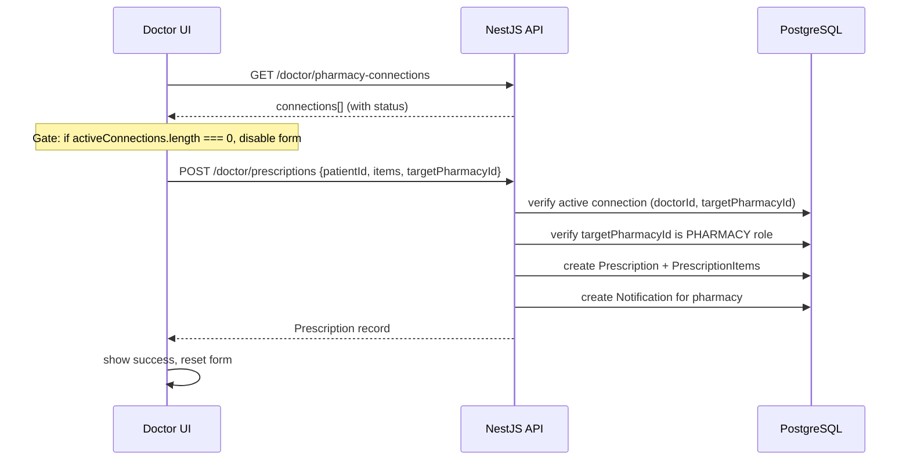
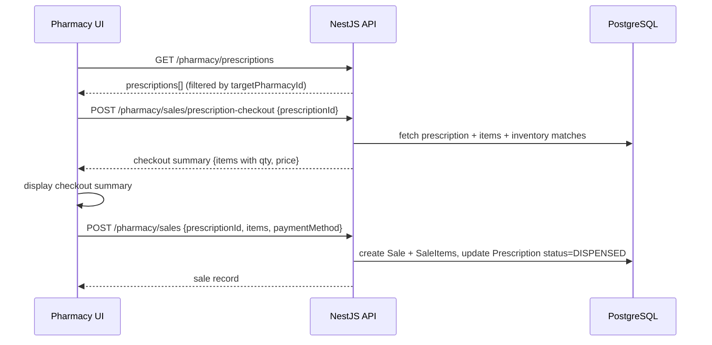

# Design Document: Prescription–Pharmacy Flow

## Overview

This feature completes the end-to-end prescription workflow between doctors and pharmacies in the HealthLink platform. The foundation already exists: `DoctorPharmacyConnection` (PENDING/ACTIVE/INACTIVE), `Prescription` with `targetPharmacyId`, backend endpoints for connection management and prescription creation, and frontend pages for both dashboards.

The work required falls into three categories:

1. **Backend gaps** — two missing endpoints (`GET /doctor/patients/:patientId/prescriptions`, `GET /pharmacy/doctor-connections`) and hardening of existing ones (connection validation on prescription creation, role guard on accept endpoint).
2. **Frontend gaps** — the doctor prescriptions page needs a connection gate, real recent-prescriptions data, and a working draft save; the patient profile needs a prescription history section; the pharmacy dashboard needs a Doctor Connections tab and a Checkout flow replacing the current Dispense button.
3. **Wiring** — the existing `POST /doctor/prescriptions` already validates active connections and sets `targetPharmacyId`, but the frontend does not yet enforce the gate or pass `targetPharmacyId` correctly in all cases.

---

## Architecture

The system follows the existing layered architecture:

```
Browser (Next.js 14 App Router)
  └── React pages + TanStack Query hooks
        └── apiFetch (JWT-attached, cached)
              └── Next.js API rewrite proxy (/api → localhost:3001)
                    └── NestJS backend
                          ├── DoctorController / DoctorService
                          ├── PharmacyController / PharmacyService
                          └── PrismaService (PostgreSQL)
```

No new infrastructure is introduced. All changes are additive within the existing modules.

### Data Flow: Prescription Creation



### Data Flow: Pharmacy Checkout



---

## Components and Interfaces

### Backend Components

#### DoctorService (existing — additions only)

New method: `getPatientPrescriptions(patientId, doctorId, tenantId)`
- Verifies patient belongs to doctor's tenant (403 if not)
- Returns prescriptions filtered by `doctorId` and `patientId`, ordered by `createdAt` desc
- Includes `items` with medicine names and `targetPharmacy` name

New method: `getRecentPrescriptions(doctorId, limit)`
- Returns the N most recent prescriptions for the doctor
- Includes `patient.name`, `items` count, `status`, `createdAt`

Existing method `createPrescription` — already validates active connection and `targetPharmacyId`. No changes needed to the service logic; the controller already calls it correctly.

Existing method `acceptConnection` — already checks `pharmacyId` match. The controller `@Roles` decorator needs to be fixed: currently the controller class is `@Roles(Role.DOCTOR)` and the `acceptConnection` route overrides with `@Roles(Role.PHARMACY)`, but NestJS `RolesGuard` uses the most specific decorator. This is already correct per the existing code — no change needed.

#### PharmacyService (existing — additions only)

New method: `listDoctorConnections(pharmacyUserId, status?)`
- Returns `DoctorPharmacyConnection` records where `pharmacyId === pharmacyUserId`
- Optionally filters by `status`
- Includes `doctor: { id, name, email }`

#### PharmacyController (existing — additions only)

New route: `GET /pharmacy/doctor-connections`
- Calls `pharmacyService.listDoctorConnections(req.user.sub, query.status)`
- Restricted to `Role.PHARMACY`

#### DoctorController (existing — additions only)

New route: `GET /doctor/patients/:patientId/prescriptions`
- Calls `doctorService.getPatientPrescriptions(patientId, req.user.sub, req.user.tenantId)`
- Restricted to `Role.DOCTOR`

New route: `GET /doctor/prescriptions`
- Calls `doctorService.getRecentPrescriptions(req.user.sub, query.limit ?? 5)`
- Restricted to `Role.DOCTOR`

### New DTOs

**`ConnectionQueryDto`** (pharmacy module):
```typescript
class ConnectionQueryDto {
  @IsOptional()
  @IsEnum(ConnectionStatus)
  status?: ConnectionStatus;
}
```

**`PatientPrescriptionsQueryDto`** (doctor module):
```typescript
class PatientPrescriptionsQueryDto {
  // No additional fields needed; patientId comes from path param
}
```

**`RecentPrescriptionsQueryDto`** (doctor module):
```typescript
class RecentPrescriptionsQueryDto {
  @IsOptional()
  @IsInt()
  @Min(1)
  @Max(50)
  limit?: number = 5;
}
```

### Frontend Components

#### New: `PharmacyDoctorConnectionsTab` (pharmacy dashboard)

Location: `frontend/src/app/dashboard/pharmacy/doctor-connections/page.tsx`

Responsibilities:
- Fetches `GET /pharmacy/doctor-connections?status=PENDING` via new `useDoctorConnections` hook
- Displays each pending request with doctor name and email
- "Accept" button → `PATCH /doctor/pharmacy-connections/:id/accept`
- "Reject" button → `DELETE /doctor/pharmacy-connections/:id`
- Empty state when no pending requests

#### Updated: `DoctorPrescriptionsPage`

Location: `frontend/src/app/dashboard/doctor/prescriptions/page.tsx`

Changes:
- Add connection gate: if `activeConnections.length === 0`, show message and disable "Create & Send"
- Auto-select pharmacy when exactly one active connection
- Show dropdown when two or more active connections
- Wire "Save as Draft" to call `POST /doctor/prescriptions` without `targetPharmacyId`
- Replace mock recent prescriptions with real data from `GET /doctor/prescriptions`
- Add client-side validation before submit (patient required, at least one item, pharmacy required if multiple connections)

#### Updated: `DoctorPatientsPage` / Patient Profile

Location: `frontend/src/app/dashboard/doctor/patients/page.tsx`

Changes:
- Add a patient detail view (slide-out panel or dedicated route `/dashboard/doctor/patients/[id]`)
- Fetch `GET /doctor/patients/:patientId/prescriptions` via new `usePatientPrescriptions` hook
- Display prescription history: date/time, medicine count, target pharmacy name, status
- Empty state when no prescriptions

#### Updated: `PharmacyPrescriptionsPage`

Location: `frontend/src/app/dashboard/pharmacy/prescriptions/page.tsx`

Changes:
- Replace "Dispense" button with "Checkout" button for PENDING prescriptions
- On "Checkout" click: call `POST /pharmacy/sales/prescription-checkout` and display the checkout summary modal
- Checkout summary shows: medicine name, prescribed qty, available qty, price per unit, total
- From checkout summary, allow completing the sale via `POST /pharmacy/sales`

#### New: `CheckoutSummaryModal`

Location: `frontend/src/components/CheckoutSummaryModal.tsx`

Props:
```typescript
interface CheckoutSummaryModalProps {
  checkoutData: PrescriptionCheckoutResponse;
  onConfirm: (saleData: CreateSaleInput) => void;
  onClose: () => void;
  isSubmitting: boolean;
}
```

Displays each bill item with availability indicator, payment method selector, and confirm button.

### New Frontend Hooks

**`usePharmacyQueries.ts` additions:**
```typescript
export function useDoctorConnections(status?: string) // GET /pharmacy/doctor-connections
export function useAcceptConnection()                  // PATCH /doctor/pharmacy-connections/:id/accept
export function useRejectConnection()                  // DELETE /doctor/pharmacy-connections/:id
```

**`useDoctorQueries.ts` additions:**
```typescript
export function useRecentPrescriptions(limit?: number) // GET /doctor/prescriptions
export function usePatientPrescriptions(patientId: string) // GET /doctor/patients/:patientId/prescriptions
```

---

## Data Models

No schema changes are required. All necessary fields already exist:

| Model | Relevant Fields | Notes |
|---|---|---|
| `DoctorPharmacyConnection` | `doctorId`, `pharmacyId`, `status` (PENDING/ACTIVE/INACTIVE) | Already exists |
| `Prescription` | `patientId`, `doctorId`, `status` (PENDING/DISPENSED/CANCELLED), `targetPharmacyId` | Already exists |
| `PrescriptionItem` | `prescriptionId`, `medicineId`, `quantity`, `dosage`, `frequency`, `duration` | Already exists |
| `Notification` | `userId`, `type`, `message`, `isRead` | Used for pharmacy notifications |

### API Response Shapes

**`GET /doctor/prescriptions`** (new):
```json
{
  "data": [
    {
      "id": "uuid",
      "status": "PENDING",
      "createdAt": "2024-01-15T10:30:00Z",
      "patient": { "id": "uuid", "name": "John Doe" },
      "items": [{ "id": "uuid", "medicine": { "name": "Metformin" }, "quantity": 30 }],
      "targetPharmacyId": "uuid"
    }
  ],
  "total": 12,
  "limit": 5
}
```

**`GET /doctor/patients/:patientId/prescriptions`** (new):
```json
[
  {
    "id": "uuid",
    "status": "DISPENSED",
    "createdAt": "2024-01-15T10:30:00Z",
    "targetPharmacyId": "uuid",
    "targetPharmacy": { "id": "uuid", "name": "City Pharmacy" },
    "items": [
      { "id": "uuid", "medicine": { "name": "Metformin" }, "quantity": 30, "dosage": "500mg", "frequency": "Twice daily" }
    ]
  }
]
```

**`GET /pharmacy/doctor-connections`** (new):
```json
[
  {
    "id": "uuid",
    "status": "PENDING",
    "createdAt": "2024-01-15T10:30:00Z",
    "doctor": { "id": "uuid", "name": "Dr. Smith", "email": "smith@clinic.com" }
  }
]
```

---

## Correctness Properties

*A property is a characteristic or behavior that should hold true across all valid executions of a system — essentially, a formal statement about what the system should do. Properties serve as the bridge between human-readable specifications and machine-verifiable correctness guarantees.*

### Property 1: Pharmacy list completeness

*For any* set of users with role `PHARMACY` registered in the system, `GET /doctor/pharmacies` SHALL return an entry for every one of them, and each entry SHALL include `id`, `name`, `email`, and `connectionStatus`.

**Validates: Requirements 1.1, 1.2**

---

### Property 2: Prescription form gate matches active connection count

*For any* list of `DoctorPharmacyConnection` records, the "Create & Send" button's disabled state SHALL equal `(activeConnections.length === 0)`, and the gate message SHALL be visible if and only if `activeConnections.length === 0`.

**Validates: Requirements 3.1, 3.2, 3.3**

---

### Property 3: Single active connection auto-selects pharmacy

*For any* connections list containing exactly one entry with `status === ACTIVE`, the prescription form's `targetPharmacyId` field SHALL be pre-populated with that connection's `pharmacyId`, and no dropdown SHALL be rendered.

**Validates: Requirements 3.4**

---

### Property 4: Multiple active connections populate dropdown

*For any* connections list containing N entries with `status === ACTIVE` where N ≥ 2, the pharmacy dropdown SHALL contain exactly N options, one per active connection.

**Validates: Requirements 3.5**

---

### Property 5: Prescription creation sets correct status and target

*For any* valid prescription payload `(patientId, items, targetPharmacyId)` where an `ACTIVE` `DoctorPharmacyConnection` exists between the authenticated doctor and `targetPharmacyId`, the created `Prescription` record SHALL have `status = PENDING` and `targetPharmacyId` equal to the submitted value.

**Validates: Requirements 5.1, 12.1**

---

### Property 6: Prescription creation triggers pharmacy notification

*For any* prescription created with a non-null `targetPharmacyId`, a `Notification` record SHALL be created with `userId = targetPharmacyId`.

**Validates: Requirements 5.2**

---

### Property 7: Draft prescription creates no notification

*For any* prescription created without a `targetPharmacyId` (draft), no `Notification` record SHALL be created for any pharmacy user.

**Validates: Requirements 5.5**

---

### Property 8: Recent prescriptions are ordered by createdAt descending

*For any* doctor with N prescriptions, `GET /doctor/prescriptions` SHALL return items ordered such that for every adjacent pair `(items[i], items[i+1])`, `items[i].createdAt >= items[i+1].createdAt`.

**Validates: Requirements 6.3, 7.3, 13.4**

---

### Property 9: Recent prescriptions response includes required fields

*For any* prescription returned by `GET /doctor/prescriptions`, the response object SHALL include `patient.name`, `createdAt`, `items` (array with at least medicine name and quantity), and `status`.

**Validates: Requirements 6.2**

---

### Property 10: Patient prescription history is scoped to doctor and patient

*For any* `(doctorId, patientId)` pair, `GET /doctor/patients/:patientId/prescriptions` SHALL return only prescriptions where both `prescription.doctorId === doctorId` AND `prescription.patientId === patientId`. No prescriptions from other doctors or for other patients SHALL appear.

**Validates: Requirements 7.1, 7.5, 13.1**

---

### Property 11: Patient prescription history includes required fields

*For any* prescription returned by `GET /doctor/patients/:patientId/prescriptions`, the response object SHALL include `id`, `status`, `createdAt`, `targetPharmacyId`, and `items` with medicine names.

**Validates: Requirements 7.2, 13.2**

---

### Property 12: Pharmacy connections endpoint scoped to authenticated pharmacy

*For any* pharmacy user P, `GET /pharmacy/doctor-connections` SHALL return only `DoctorPharmacyConnection` records where `pharmacyId === P.id`. No connections belonging to other pharmacies SHALL appear.

**Validates: Requirements 8.1, 14.1**

---

### Property 13: Pharmacy connections status filter is exact

*For any* status value S ∈ {PENDING, ACTIVE, INACTIVE}, `GET /pharmacy/doctor-connections?status=S` SHALL return only connections where `status === S`.

**Validates: Requirements 14.3**

---

### Property 14: Pharmacy connections response includes doctor details

*For any* connection returned by `GET /pharmacy/doctor-connections`, the response object SHALL include `doctor.id`, `doctor.name`, and `doctor.email`.

**Validates: Requirements 8.2, 14.2**

---

### Property 15: Pharmacy prescriptions list is scoped to target pharmacy

*For any* pharmacy user P, `GET /pharmacy/prescriptions` SHALL return only prescriptions where `targetPharmacyId === P.id`. Prescriptions with `targetPharmacyId = null` or `targetPharmacyId` referencing a different pharmacy SHALL NOT appear.

**Validates: Requirements 9.1, 9.2, 9.4**

---

### Property 16: Pharmacy prescriptions response includes required fields

*For any* prescription returned by `GET /pharmacy/prescriptions`, the response object SHALL include `doctor.name`, `patient.name`, `createdAt`, `items` (with medicine names), and `status`.

**Validates: Requirements 9.3**

---

### Property 17: Checkout response includes all prescribed items

*For any* prescription with N `PrescriptionItem` records, `POST /pharmacy/sales/prescription-checkout` SHALL return a response with exactly N bill items, each containing `medicineName`, `prescribedQuantity`, `availableQuantity`, `pricePerUnit`, and `available` (boolean).

**Validates: Requirements 10.3**

---

### Property 18: Connection acceptance is restricted to the target pharmacy

*For any* `DoctorPharmacyConnection` record C and any user U where `U.id !== C.pharmacyId`, calling `PATCH /doctor/pharmacy-connections/C.id/accept` with U's JWT SHALL return HTTP 403.

**Validates: Requirements 11.1, 11.2**

---

### Property 19: Accept endpoint rejects non-PENDING connections

*For any* `DoctorPharmacyConnection` record C where `C.status !== PENDING`, calling `PATCH /doctor/pharmacy-connections/C.id/accept` SHALL return HTTP 404.

**Validates: Requirements 11.3**

---

### Property 20: Prescription dispatch requires active connection

*For any* prescription creation request with a `targetPharmacyId` where no `ACTIVE` `DoctorPharmacyConnection` exists between the authenticated doctor and `targetPharmacyId`, `POST /doctor/prescriptions` SHALL return HTTP 400.

**Validates: Requirements 12.1, 12.2**

---

### Property 21: Draft prescription bypasses connection validation

*For any* valid prescription payload without `targetPharmacyId`, `POST /doctor/prescriptions` SHALL succeed regardless of whether any `DoctorPharmacyConnection` exists for the authenticated doctor.

**Validates: Requirements 12.3**

---

### Property 22: Prescription dispatch validates pharmacy role

*For any* `targetPharmacyId` that refers to a `User` with `role !== PHARMACY`, `POST /doctor/prescriptions` SHALL return HTTP 400.

**Validates: Requirements 12.4**

---

### Property 23: Patient prescription history enforces tenant isolation

*For any* `patientId` where `patient.tenantId !== doctor.tenantId`, `GET /doctor/patients/:patientId/prescriptions` SHALL return HTTP 403.

**Validates: Requirements 13.3**

---

## Error Handling

### Backend Error Responses

| Scenario | HTTP Status | Message |
|---|---|---|
| `POST /doctor/prescriptions` — no active connection with target pharmacy | 400 | `"No active connection exists with the specified pharmacy"` |
| `POST /doctor/prescriptions` — `targetPharmacyId` is not a PHARMACY user | 400 | `"Target pharmacy not found or is not a pharmacy account"` |
| `PATCH /doctor/pharmacy-connections/:id/accept` — user is not the target pharmacy | 403 | `"You are not authorized to accept this connection"` |
| `PATCH /doctor/pharmacy-connections/:id/accept` — connection not found or not PENDING | 404 | `"Pending connection not found"` |
| `GET /doctor/patients/:patientId/prescriptions` — patient not in doctor's tenant | 403 | `"Patient does not belong to your tenant"` |
| `POST /doctor/pharmacy-connections` — connection already exists | 409 | `"A connection with this pharmacy already exists"` |
| `POST /pharmacy/sales/prescription-checkout` — prescription not found or wrong pharmacy | 404 | `"Prescription not found"` |

### Frontend Error Handling

- All API errors are surfaced via TanStack Query's `isError` / `error` state
- Validation errors (empty items, no patient, no pharmacy) are caught client-side before the API call and displayed inline
- The existing `apiFetch` wrapper already handles 4xx/5xx with user-friendly messages
- Mutation errors are displayed in a red alert banner near the submit button
- Success states reset the form and show a green confirmation banner

### Connection Gate Logic

```typescript
// In DoctorPrescriptionsPage
const activeConnections = connections.filter(c => c.status === 'ACTIVE');
const isGated = activeConnections.length === 0;
const autoSelectedPharmacyId = activeConnections.length === 1
  ? (activeConnections[0].pharmacy?.id ?? activeConnections[0].pharmacyId)
  : '';
```

---

## Testing Strategy

### Unit Tests (example-based)

Focus on specific behaviors and edge cases:

- `DoctorService.getPatientPrescriptions` — returns 403 when patient not in tenant
- `DoctorService.createPrescription` — returns 400 when no active connection with target pharmacy
- `DoctorService.createPrescription` — returns 400 when targetPharmacyId is not a PHARMACY user
- `DoctorService.acceptConnection` — returns 403 when caller is not the target pharmacy
- `DoctorService.acceptConnection` — returns 404 when connection is not PENDING
- `PharmacyService.listDoctorConnections` — returns only connections for the authenticated pharmacy
- `PharmacyService.listPrescriptions` — returns only prescriptions where targetPharmacyId matches
- UI: `DoctorPrescriptionsPage` renders gate message when zero active connections
- UI: `DoctorPrescriptionsPage` renders disabled "Create & Send" when zero active connections
- UI: `PharmacyPrescriptionsPage` renders "Checkout" button for PENDING prescriptions
- UI: `PharmacyPrescriptionsPage` does not render "Checkout" for DISPENSED/CANCELLED prescriptions
- UI: `CheckoutSummaryModal` renders all bill items with required fields

### Property-Based Tests

The project uses Jest (configured in `frontend/jest.config.js`). For property-based testing, use **fast-check** (`npm install --save-dev fast-check`).

Each property test runs a minimum of **100 iterations**.

Tag format: `// Feature: prescription-pharmacy-flow, Property N: <property_text>`

**Property 2 — Prescription form gate:**
```typescript
// Feature: prescription-pharmacy-flow, Property 2: form gate matches active connection count
fc.assert(fc.property(
  fc.array(fc.record({ status: fc.constantFrom('PENDING', 'ACTIVE', 'INACTIVE') })),
  (connections) => {
    const active = connections.filter(c => c.status === 'ACTIVE');
    const isGated = active.length === 0;
    // assert: button disabled === isGated, message visible === isGated
    expect(computeGateState(connections)).toEqual({ disabled: isGated, showMessage: isGated });
  }
), { numRuns: 100 });
```

**Property 5 — Prescription creation sets correct status and target:**
```typescript
// Feature: prescription-pharmacy-flow, Property 5: prescription creation sets correct status and target
fc.assert(fc.property(
  fc.record({ patientId: fc.uuid(), targetPharmacyId: fc.uuid(), items: fc.array(validItemArb, { minLength: 1 }) }),
  async (payload) => {
    // Setup: create active connection between doctor and targetPharmacyId
    const result = await doctorService.createPrescription(payload, doctorId, tenantId);
    expect(result.status).toBe('PENDING');
    expect(result.targetPharmacyId).toBe(payload.targetPharmacyId);
  }
), { numRuns: 100 });
```

**Property 8 — Recent prescriptions ordering:**
```typescript
// Feature: prescription-pharmacy-flow, Property 8: recent prescriptions ordered by createdAt desc
fc.assert(fc.property(
  fc.array(fc.record({ createdAt: fc.date() }), { minLength: 2 }),
  (prescriptions) => {
    const sorted = sortByCreatedAtDesc(prescriptions);
    for (let i = 0; i < sorted.length - 1; i++) {
      expect(sorted[i].createdAt >= sorted[i + 1].createdAt).toBe(true);
    }
  }
), { numRuns: 100 });
```

**Property 10 — Patient prescription history scoping:**
```typescript
// Feature: prescription-pharmacy-flow, Property 10: patient prescription history scoped to doctor and patient
fc.assert(fc.property(
  fc.uuid(), fc.uuid(),
  async (doctorId, patientId) => {
    const results = await doctorService.getPatientPrescriptions(patientId, doctorId, tenantId);
    results.forEach(rx => {
      expect(rx.doctorId).toBe(doctorId);
      expect(rx.patientId).toBe(patientId);
    });
  }
), { numRuns: 100 });
```

**Property 15 — Pharmacy prescriptions scoping:**
```typescript
// Feature: prescription-pharmacy-flow, Property 15: pharmacy prescriptions scoped to target pharmacy
fc.assert(fc.property(
  fc.uuid(),
  async (pharmacyUserId) => {
    const { data } = await pharmacyService.listPrescriptions({}, pharmacyUserId);
    data.forEach(rx => {
      expect(rx.targetPharmacyId).toBe(pharmacyUserId);
    });
  }
), { numRuns: 100 });
```

**Property 18 — Connection acceptance authorization:**
```typescript
// Feature: prescription-pharmacy-flow, Property 18: connection acceptance restricted to target pharmacy
fc.assert(fc.property(
  fc.uuid(), fc.uuid(),
  async (connectionPharmacyId, callerUserId) => {
    fc.pre(callerUserId !== connectionPharmacyId);
    await expect(
      doctorService.acceptConnection(connectionId, callerUserId)
    ).rejects.toThrow(ForbiddenException);
  }
), { numRuns: 100 });
```

**Property 20 — Dispatch requires active connection:**
```typescript
// Feature: prescription-pharmacy-flow, Property 20: prescription dispatch requires active connection
fc.assert(fc.property(
  fc.uuid(), fc.uuid(),
  async (doctorId, targetPharmacyId) => {
    // No active connection exists
    await expect(
      doctorService.createPrescription({ patientId, items, targetPharmacyId }, doctorId, tenantId)
    ).rejects.toThrow(BadRequestException);
  }
), { numRuns: 100 });
```

### Integration Tests

- `POST /doctor/prescriptions` end-to-end with real DB: verify prescription + notification created
- `PATCH /doctor/pharmacy-connections/:id/accept` end-to-end: verify status changes to ACTIVE
- `GET /pharmacy/doctor-connections` end-to-end: verify filtering by pharmacyId and status
- `POST /pharmacy/sales/prescription-checkout` end-to-end: verify inventory matching logic
